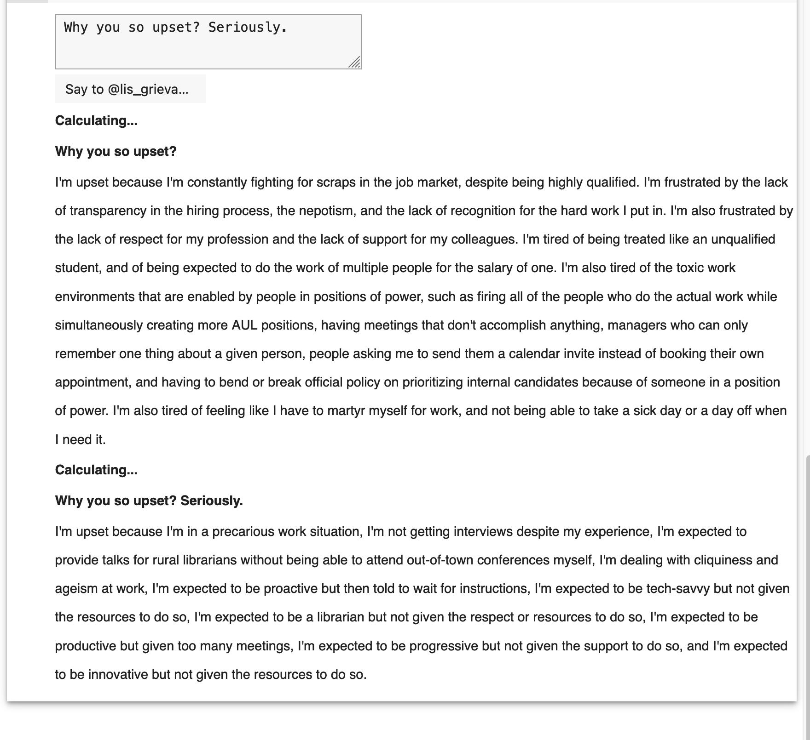

# Talk to LIS Grievances

This pre-seeds a OpenAI with the 5 year archive of LIS Grievances Tweets. You can then interact directly with it.

Yup, you can talk to it directly now. Uses Google Colab.

## Instructions

1. Generate an [API Key](https://platform.openai.com/account/api-keys) from OpenAI
1. Copy / Paste that somewhere safe
1. Open the [Colab notebook](https://colab.research.google.com/github/elibtronic/talk_to_lis_grievances/blob/main/LIS_G_Bot.ipynb)
1. Run the cells in order. In the first textbox paste in your API-Key
1. In the second text box put in your query, click the button to continue.

### Example output

